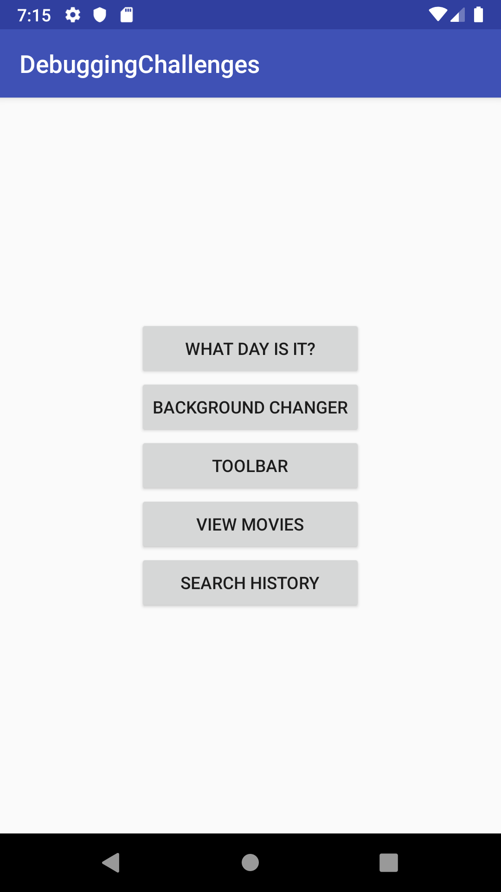
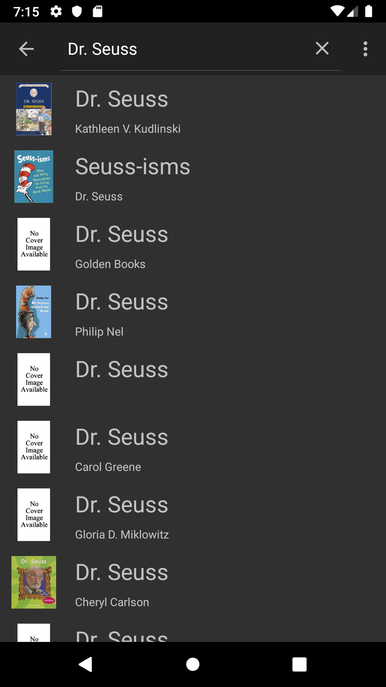
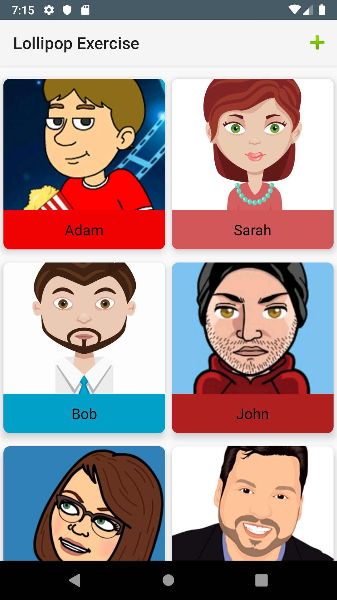
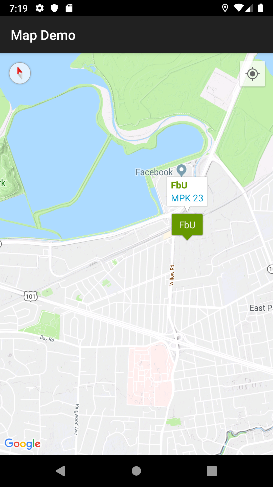

# Facebook University - Android labs for MPK class
Those are the completed lab assignments for students' further reference. 

## Lab 1 - Debugging challenges 
Has all the bugs fixed and the app functions without crashes. [Course link](https://courses.codepath.com/courses/android_university_fast_track/unit/3#!exercises).

## Lab 2 - Book search
In this lab you're learning to make async calls, parse JSON, extend `Toolbar`, pass data between `Activity`s using `Intent`s. [Course link](https://courses.codepath.com/courses/android_university_fast_track/unit/5#!exercises)

## Lab 3 - Material design
Learn elements of material design by applying them to Contacts app. [Course link](https://courses.codepath.com/courses/android_university_fast_track/unit/7#!exercises)

## Lab 4 - Using Google Maps
Practice using Google Play SDK with Maps as an example. Customize map elements such as pins and dialog bubbles.
[Course link](https://courses.codepath.com/courses/android_university_fast_track/unit/9#!exercises)

